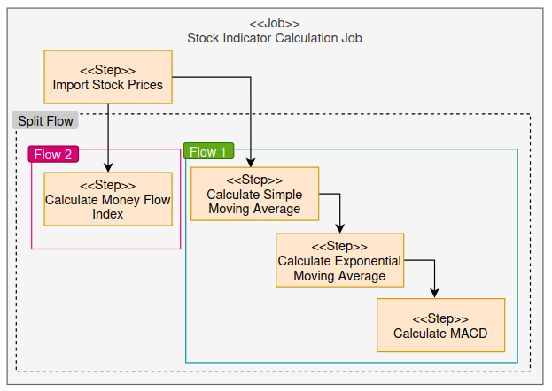

# Spring Batch Demo - Stock Market Technical Analysis Indicator Calculation

## What is it?
This demonstrates the usage of the Spring Batch framework. 
The use case is to calculate stock technical analysis indicators

## How to run this demo?

1. Start up MySQL - Make use of docker-compose.yaml in /docker to start up MySQL database in docker container. It will set up all required data schema.
2. Execute batch job - `space.gavinklfong.demo.batch.BatchApplication`

The batch job will do the following:
1. import stock prices from CSV `data/stock_market_data.csv` into database table `stock_price_history`
2. Calculate simple moving average and insert into database table `stock_price_sma`
3. Calculate exponential moving average and insert into database table `stock_price_ema`
4. Calculate MACD and insert into database table `stock_price_macd`
5. Calculate money flow index and insert into database table `stock_price_mfi`

